# Teacher Role System — Walkthrough

> How the **Super Admin**, **Admin**, and **Teacher** roles interact with the teacher management system.

---

## Table of Contents

1. [Role Overview](#1-role-overview)
2. [Super Admin / Admin — Create & Manage Teachers](#2-super-admin--admin--create--manage-teachers)
3. [Teacher Login & Routing Flow](#3-teacher-login--routing-flow)
4. [Teacher Dashboard & Scope Enforcement](#4-teacher-dashboard--scope-enforcement)
5. [Permission Architecture](#5-permission-architecture)
6. [Entity Relationships](#6-entity-relationships)
7. [Modification Flows by Role](#7-modification-flows-by-role)

---

## 1. Role Overview

| Role | Can Create Teachers | Can Assign Classes | Can Modify Teacher Data | Can Access Teacher Dashboard | Scope |
|---|---|---|---|---|---|
| **Super Admin** | ✅ (full bypass) | ✅ | ✅ All fields | ❌ (routed to `/dashboard`) | Entire school |
| **Admin** | ✅ (needs `teachers:create`) | ✅ (needs `teachers:update`) | ✅ All fields | ❌ (routed to `/dashboard`) | Entire school / campus |
| **Teacher** | ❌ | ❌ | ✅ Limited self-service (`/me`) | ✅ `/teacher/*` | Only assigned classes/sections/subjects |

---

## 2. Super Admin / Admin — Create & Manage Teachers

### 2.1 Teacher Creation Flow

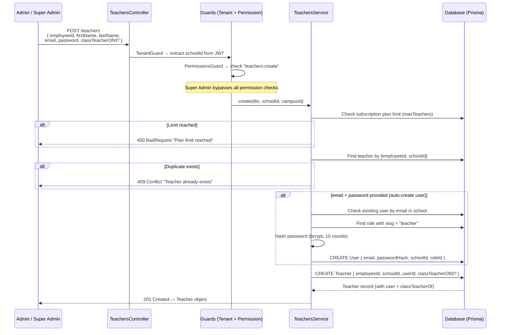

### 2.2 Assign Class to Teacher

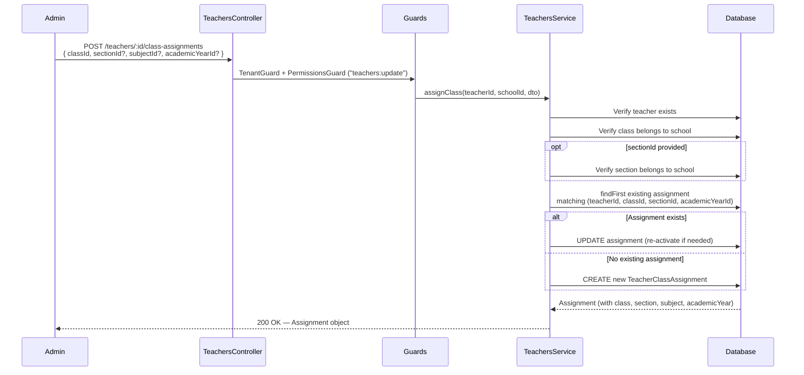

### 2.3 Update / Deactivate Teacher

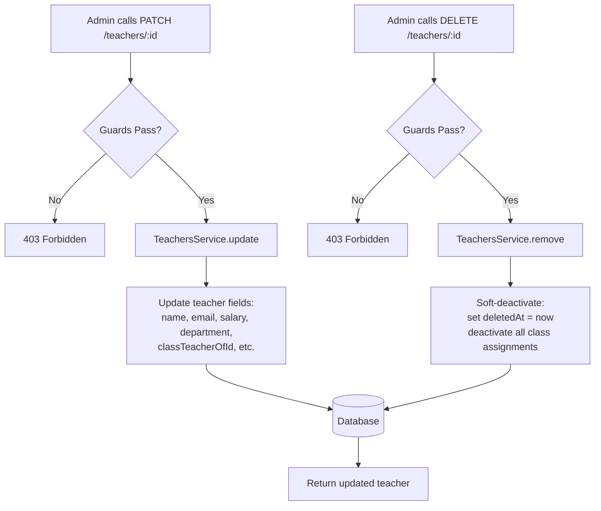

---

## 3. Teacher Login & Routing Flow

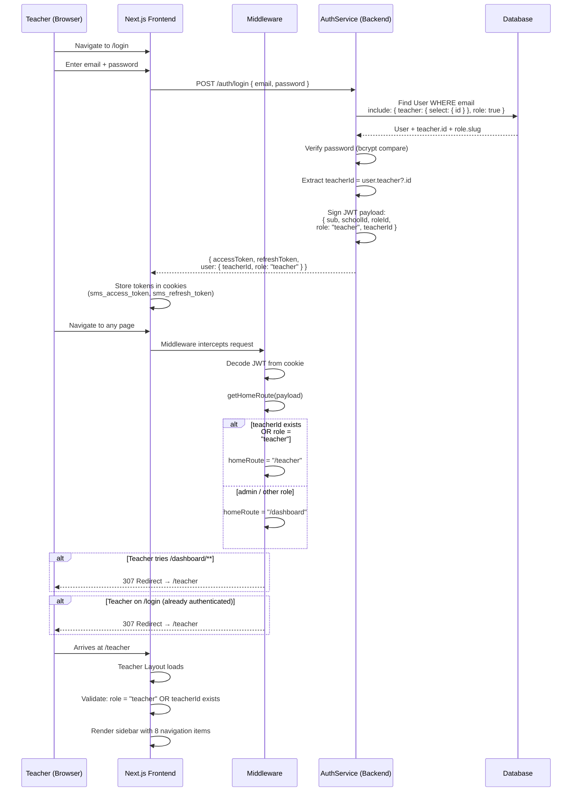

### Teacher Sidebar Navigation

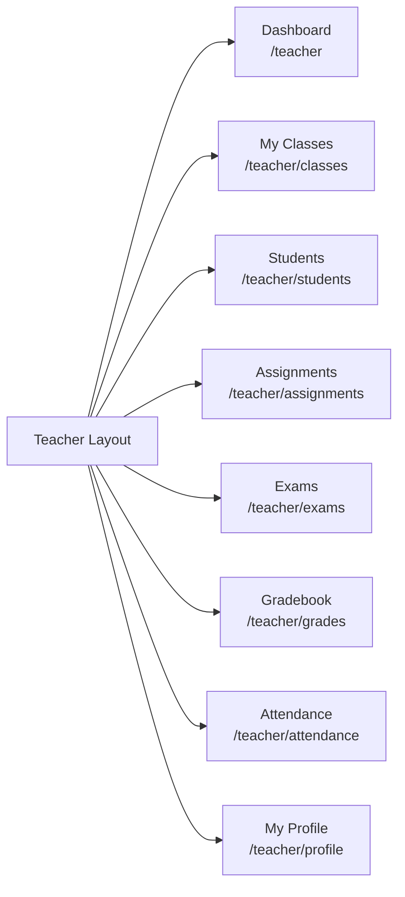

---

## 4. Teacher Dashboard & Scope Enforcement

### 4.1 How Teacher Scope Works

```mermaid
flowchart TD
    T[Teacher calls an API<br/>e.g. GET /attendance?classId=X] --> TG[TenantGuard<br/>extracts schoolId]
    TG --> PG{PermissionsGuard<br/>e.g. attendance:read}
    PG -- Missing permission --> F1[403 Forbidden]
    PG -- Has permission --> SVC[Service Layer<br/>e.g. AttendanceService]

    SVC --> TSS[TeacherScopeService.getScope<br/>teacherId, schoolId]

    TSS --> Q1[Query active<br/>TeacherClassAssignment records]
    TSS --> Q2[Query Teacher.classTeacherOfId]

    Q1 --> EXPAND{Any class-only<br/>assignments?<br/>sectionId = null}
    EXPAND -- Yes --> EXP[Expand to ALL sections<br/>of that class]
    EXPAND -- No --> MERGE

    Q2 --> CT{Is class teacher?}
    CT -- Yes --> CTA[Add classTeacherOfId<br/>to classIds<br/>+ expand all sections]
    CT -- No --> MERGE

    EXP --> MERGE[Merge into scope]
    CTA --> MERGE

    MERGE --> SCOPE["TeacherScope {<br/>classIds: [...]<br/>sectionIds: [...]<br/>subjectIds: [...]<br/>classTeacherOfId: ... | null<br/>}"]

    SCOPE --> VAL{validateFullAccess<br/>classId? sectionId? subjectId?}
    VAL -- NOT in scope --> F2[403 Forbidden<br/>"Not assigned to this class"]
    VAL -- In scope --> DATA[Return scoped data ✅]

    style F1 fill:#ff6b6b,color:#fff
    style F2 fill:#ff6b6b,color:#fff
    style DATA fill:#51cf66,color:#fff
```

### 4.2 Class Teacher Privilege

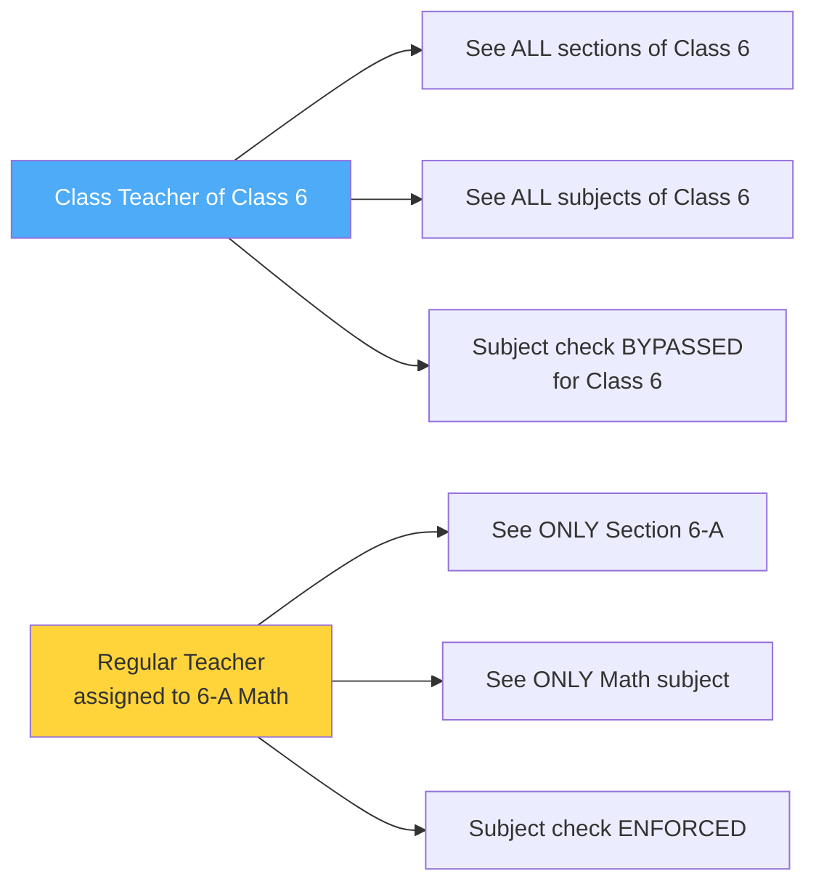

### 4.3 Teacher Self-Service Endpoints

These endpoints have **no** `@RequirePermission()` — they rely only on `teacherId` from the JWT:

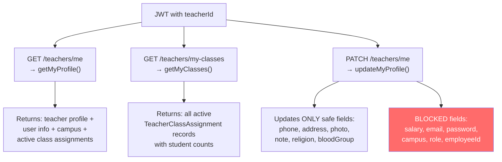

---

## 5. Permission Architecture

### 5.1 Two-Layer Access Control

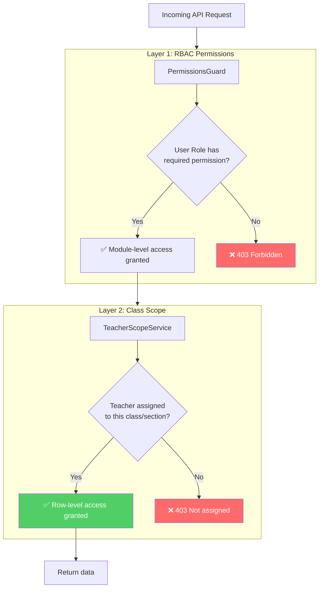

### 5.2 Guard Evaluation Order

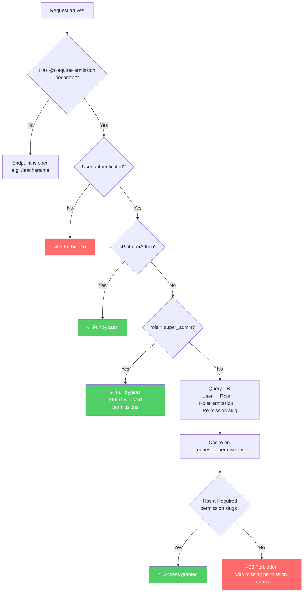

### 5.3 Teacher Permission Set (18 permissions)

| Module | Permissions |
|---|---|
| Students | `students:read` |
| Teachers | `teachers:read` |
| Academics | `academics:read` |
| Attendance | `attendance:create`, `attendance:read`, `attendance:update`, `attendance:delete` |
| Exams | `exams:create`, `exams:read`, `exams:update` |
| Assignments | `assignments:create`, `assignments:read`, `assignments:update`, `assignments:delete` |
| Grades | `grades:create`, `grades:read`, `grades:update` |
| Calendar | `calendar:read` |

---

## 6. Entity Relationships

```mermaid
erDiagram
    User ||--o| Teacher : "has (optional)"
    User }o--|| Role : "belongs to"
    Role ||--o{ RolePermission : "has"
    RolePermission }o--|| Permission : "grants"

    Teacher ||--o{ TeacherClassAssignment : "has many"
    Teacher |o--o| Class : "classTeacherOf (optional)"

    TeacherClassAssignment }o--|| Class : "assigned to"
    TeacherClassAssignment }o--o| Section : "optional"
    TeacherClassAssignment }o--o| Subject : "optional"
    TeacherClassAssignment }o--o| AcademicYear : "optional"

    Class ||--o{ Section : "has many"
    School ||--o{ Teacher : "has many"
    School ||--o{ Class : "has many"
    School ||--o{ User : "has many"

    Teacher {
        string id PK
        string employeeId UK
        string schoolId FK
        string userId FK
        string classTeacherOfId FK
        string firstName
        string lastName
        datetime deletedAt
    }

    TeacherClassAssignment {
        string id PK
        string teacherId FK
        string classId FK
        string sectionId FK
        string subjectId FK
        string academicYearId FK
        boolean isActive
    }

    User {
        string id PK
        string email
        string schoolId FK
        string roleId FK
    }
```

---

## 7. Modification Flows by Role

### 7.1 Super Admin Modifications

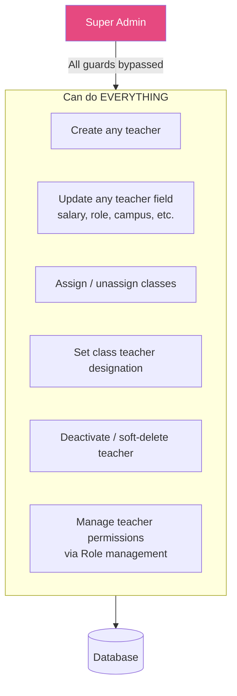

### 7.2 Admin Modifications

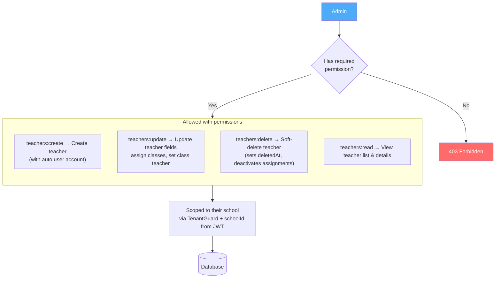

### 7.3 Teacher Self-Modifications

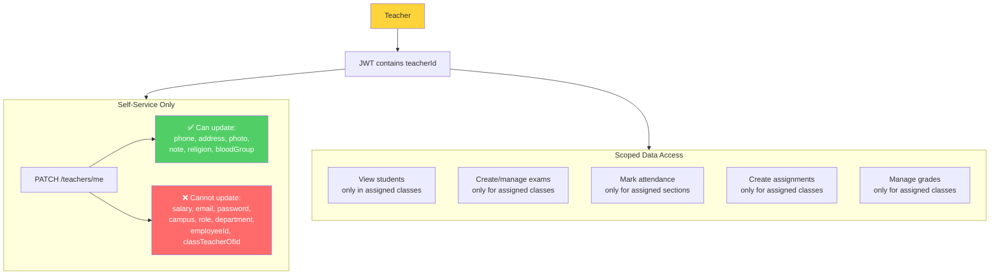

### 7.4 Complete Modification Chain

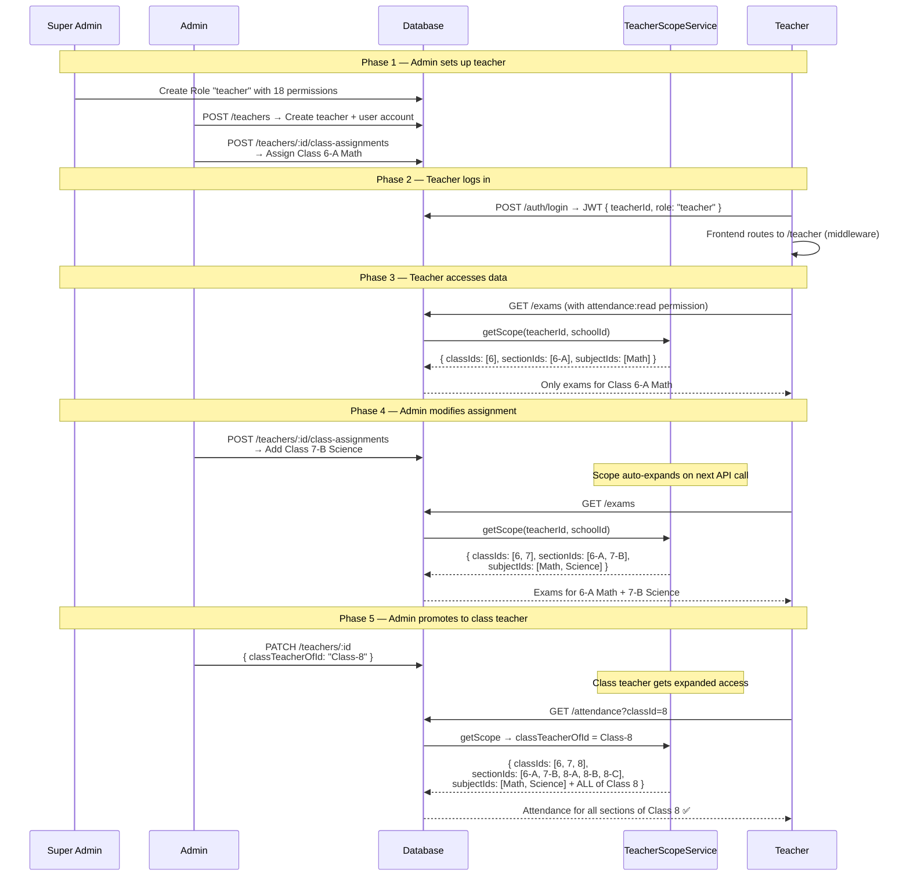

---

## Summary

| Action | Super Admin | Admin | Teacher |
|---|---|---|---|
| Create teacher & user account | ✅ Always | ✅ With `teachers:create` | ❌ |
| Update teacher (all fields) | ✅ Always | ✅ With `teachers:update` | ❌ |
| Update own profile (safe fields) | N/A | N/A | ✅ Via `/teachers/me` |
| Assign classes | ✅ Always | ✅ With `teachers:update` | ❌ |
| Set class teacher | ✅ Always | ✅ With `teachers:update` | ❌ |
| Soft-delete teacher | ✅ Always | ✅ With `teachers:delete` | ❌ |
| View scoped data (exams, grades, etc.) | N/A (uses admin dashboard) | N/A (uses admin dashboard) | ✅ Scoped to assigned classes |
| Mark attendance | N/A | N/A | ✅ Scoped to assigned sections |
| Manage permissions / roles | ✅ Always | ❌ (unless has role perms) | ❌ |
